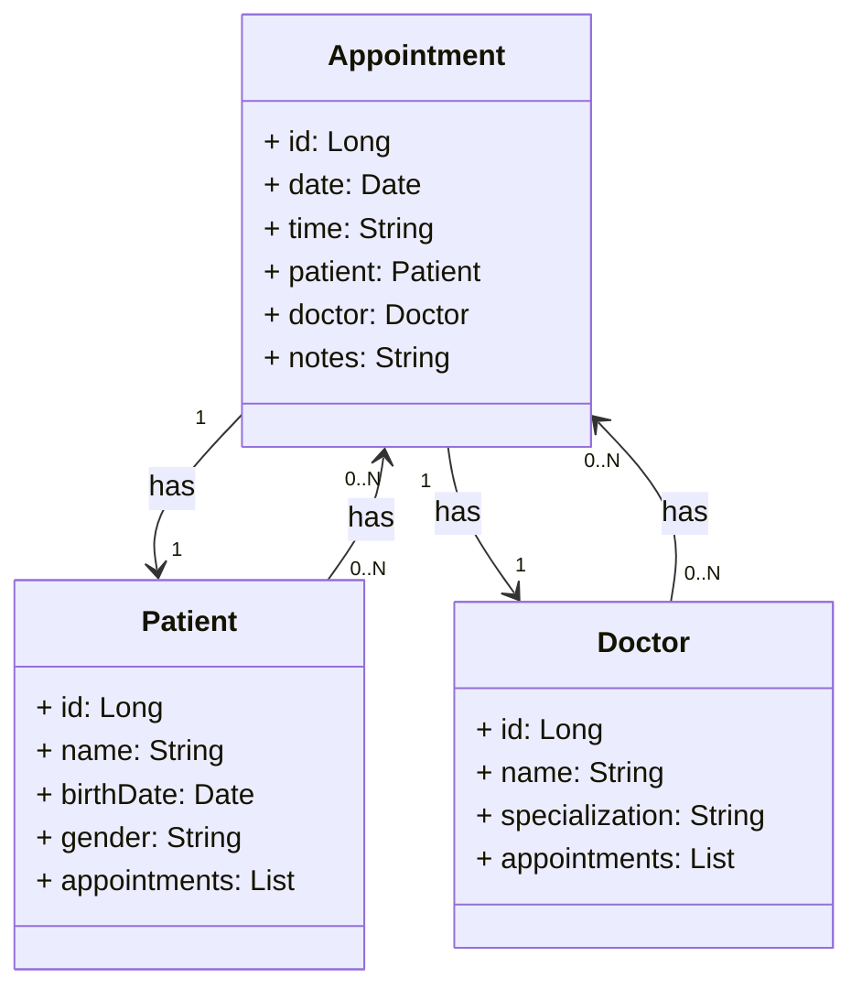

# bootcamp-fullstack-2023
Java RESTful API de um sistema de gerenciamento de consultas

```mermaid
classDiagram
    class Appointment {
        + id: Long
        + date: Date
        + time: String
        + patient: Patient
        + doctor: Doctor
        + notes: String
    }

    class Doctor {
        + id: Long
        + name: String
        + specialization: String
        + appointments: List<Appointment>
    }

    class Patient {
        + id: Long
        + name: String
        + birthDate: Date
        + gender: String
        + appointments: List<Appointment>
    }

    Appointment "1" --> "1" Patient : has
    Appointment "1" --> "1" Doctor : has
    Doctor "0..N" --> "0..N" Appointment : has
    Patient "0..N" --> "0..N" Appointment : has
```

